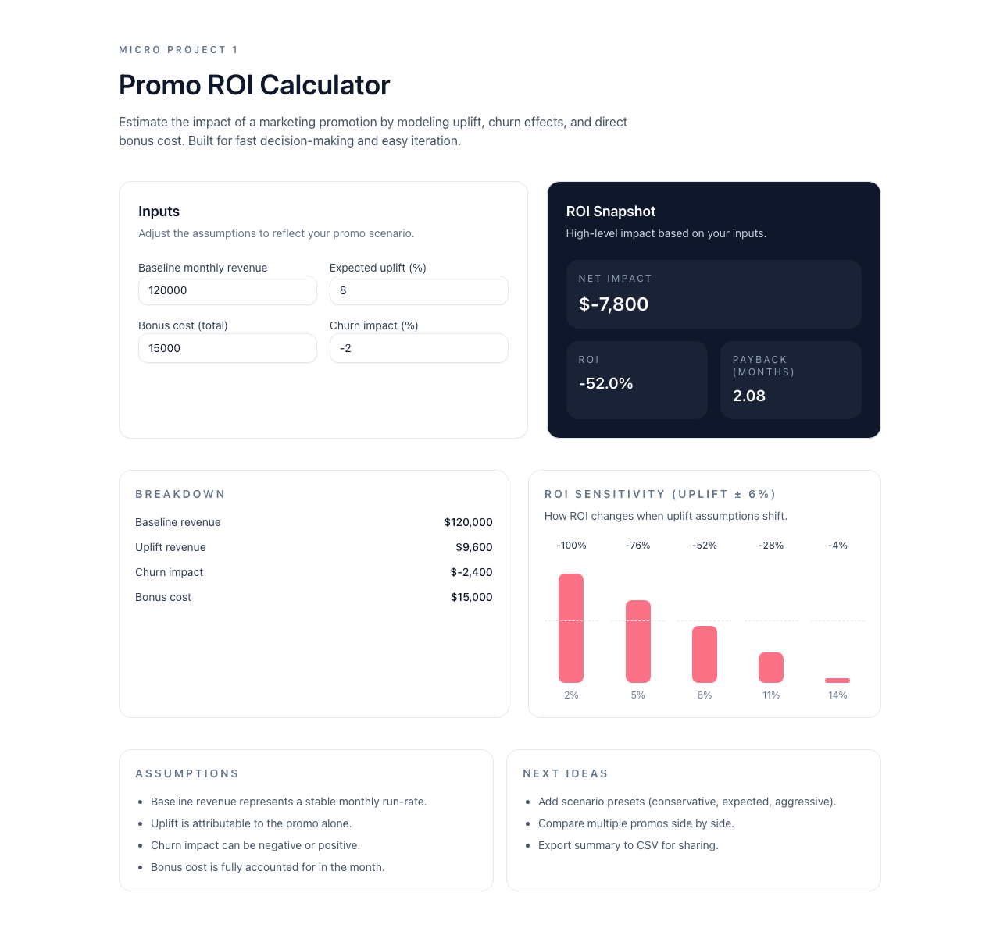

# Promo ROI Calculator

A lightweight tool for iGaming product and marketing teams to sanity-check promotion economics fast. Plug in baseline revenue, expected uplift, churn impact, and bonus cost to get a clear ROI snapshot, payback period, and sensitivity view before you ship a promo.



## Quick Start

```bash
npm install
npm run dev
```

Open http://localhost:3000

## How The Calculation Works

Inputs:
- Baseline monthly revenue
- Expected uplift (%) from the promo
- Bonus cost (total)
- Churn impact (%) — can be negative or positive

Formulas:
- Uplift revenue = baseline revenue * uplift %
- Churn impact = baseline revenue * churn %
- Net impact = uplift revenue + churn impact - bonus cost
- ROI % = (net impact / bonus cost) * 100
- Payback months = bonus cost / (uplift revenue + churn impact)

## Example 1 (Matches the defaults)

Inputs:
- Baseline revenue = 120,000
- Uplift = 8%
- Bonus cost = 15,000
- Churn impact = -2%

Calculation:
- Uplift revenue = 120,000 * 0.08 = 9,600
- Churn impact = 120,000 * -0.02 = -2,400
- Net impact = 9,600 - 2,400 - 15,000 = -7,800
- ROI = (-7,800 / 15,000) * 100 = -52.0%
- Payback = 15,000 / (9,600 - 2,400) = 15,000 / 7,200 = 2.08 months

Interpretation:
- The promo loses money in month one, but payback is a bit over 2 months if uplift holds.

## Example 2 (Positive ROI)

Inputs:
- Baseline revenue = 200,000
- Uplift = 12%
- Bonus cost = 10,000
- Churn impact = +1%

Calculation:
- Uplift revenue = 200,000 * 0.12 = 24,000
- Churn impact = 200,000 * 0.01 = 2,000
- Net impact = 24,000 + 2,000 - 10,000 = 16,000
- ROI = (16,000 / 10,000) * 100 = 160%
- Payback = 10,000 / 26,000 = 0.38 months

Interpretation:
- Strongly positive ROI with rapid payback.

## Deploy (Vercel)

```bash
npx vercel
```

## Suggested Add-ons

- Charts: Recharts or Chart.js
- Data: local JSON or Supabase free tier
- CI: GitHub Actions (lint + build)
