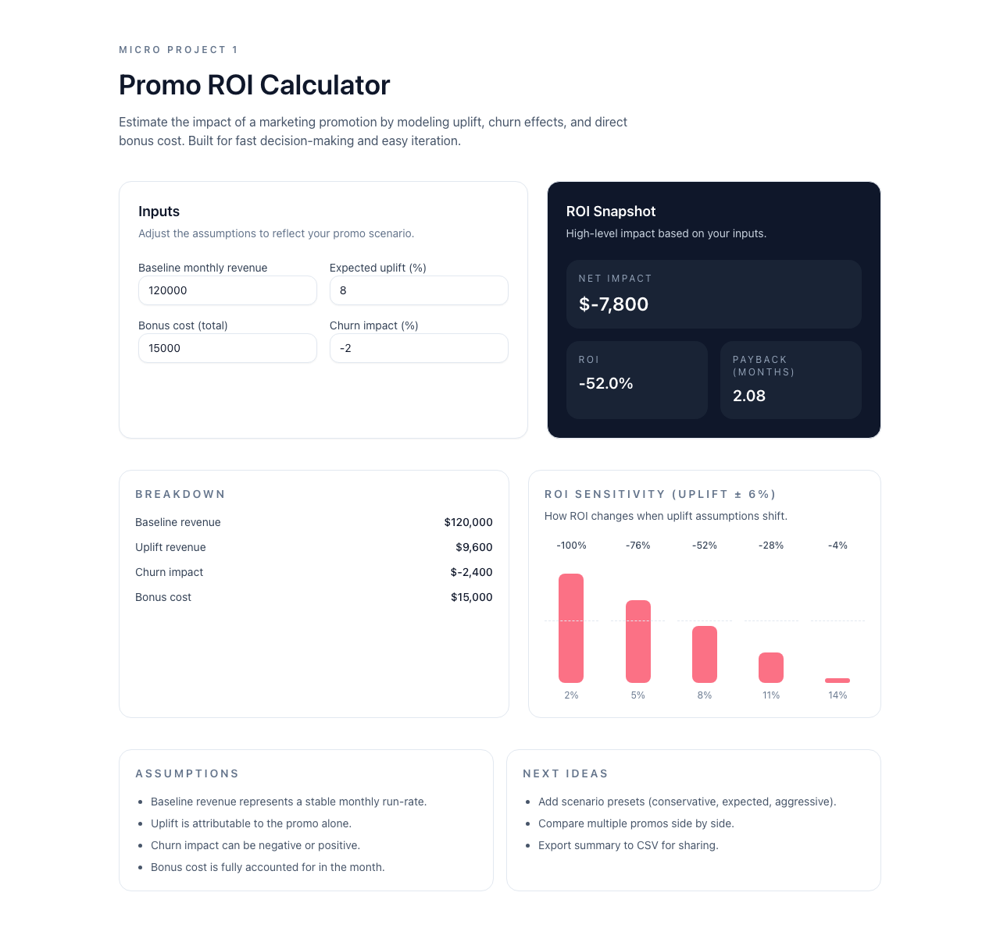

# Promo ROI Calculator

A lightweight tool for iGaming product and marketing teams to sanity-check promotion economics fast. Plug in baseline revenue, expected uplift, churn impact, and bonus cost to get a clear ROI snapshot, payback period, sensitivity view, and required uplift targets before you ship a promo.

Live demo: [promo-roi-calculator.vercel.app](https://promo-roi-calculator.vercel.app/)



## Quick Start

```bash
npm install
npm run dev
```

Open http://localhost:3000

## Usage Guide

1. Choose a preset
- Start with `Conservative`, `Expected`, or `Aggressive` to load a realistic baseline.

2. Adjust key assumptions
- `Baseline monthly revenue`: stable monthly run-rate before promo.
- `Expected uplift (%)`: incremental revenue lift from promo.
- `Bonus cost (total)`: total promo spend.
- `Churn impact (%)`: negative means churn worsens, positive means retention improves.

3. Read the ROI Snapshot
- `Net Impact`: monthly outcome after uplift, churn effect, and bonus cost.
- `ROI`: net impact as a percentage of bonus cost.
- `Payback`: months required to recover bonus cost.

4. Use ROI Sensitivity
- Shows how ROI changes when uplift assumptions move by ±6%.
- Useful for best-case/worst-case planning before launch.

5. Use Planning Targets (new)
- Set `Target ROI (%)` (for example `25`).
- Check `Break-even uplift` to know the minimum uplift needed for ROI = 0%.
- Check `Uplift for target ROI` to know the uplift required to hit your chosen ROI goal.

## How The Calculation Works

Inputs:
- Baseline monthly revenue
- Expected uplift (%) from the promo
- Bonus cost (total)
- Churn impact (%) — can be negative or positive

Formulas:
- Uplift revenue = baseline revenue * uplift %
- Churn impact = baseline revenue * churn %
- Net impact = uplift revenue + churn impact - bonus cost
- ROI % = (net impact / bonus cost) * 100
- Payback months = bonus cost / (uplift revenue + churn impact)
- Break-even uplift % = (bonus cost * 100 / baseline revenue) - churn impact %
- Target uplift % = (bonus cost * (1 + target ROI / 100) * 100 / baseline revenue) - churn impact %

## Example 1 (Matches defaults)

Inputs:
- Baseline revenue = 120,000
- Uplift = 8%
- Bonus cost = 15,000
- Churn impact = -2%

Calculation:
- Uplift revenue = 120,000 * 0.08 = 9,600
- Churn impact = 120,000 * -0.02 = -2,400
- Net impact = 9,600 - 2,400 - 15,000 = -7,800
- ROI = (-7,800 / 15,000) * 100 = -52.0%
- Payback = 15,000 / (9,600 - 2,400) = 2.08 months

Target planning with target ROI = 25%:
- Break-even uplift = (15,000 * 100 / 120,000) - (-2) = 14.50%
- Uplift for 25% ROI = (15,000 * 1.25 * 100 / 120,000) - (-2) = 17.63%

Interpretation:
- At current 8% uplift, the promo is below break-even.
- You need about 14.5% uplift to break even and 17.6% uplift for 25% ROI.

## Deploy (Vercel)

```bash
npx vercel
```

## Suggested Add-ons

- CSV export for board/stakeholder sharing
- Saved scenarios and comparison table
- API-backed historical promo benchmarks
- CI: GitHub Actions (lint + build)
